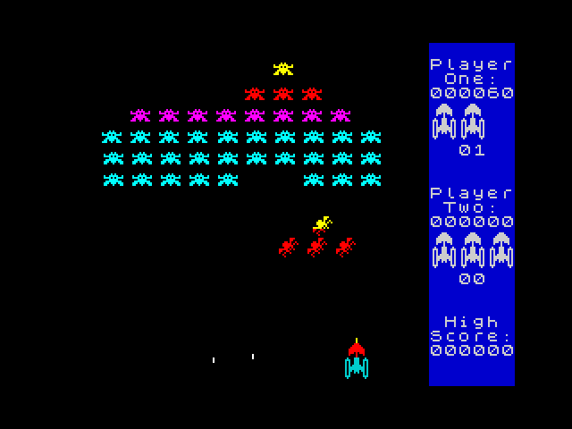

# galaxians-sa-disassembly

This is a disassembly of the ZX Spectrum game [Galaxians](https://spectrumcomputing.co.uk/entry/1934/ZX-Spectrum/Galaxians).

I started this to learn a bit about the [Spectrum Analyser disassembly tool](https://colourclash.co.uk/spectrum-analyser/),
so it's a different sort of thing to [my Space Raiders disassembly](https://www.derekfountain.org/space_raiders/index.html).
The disassembly is currently unfinshed. I did get quite a bit done. The graphics part is mostly disassembled and all the sprites are
labeled. The scoring is done as are many utility routines.

To be honest, it's not a very nice program to disassemble. It looks very much like the 2nd player option was bolted on at
the end. There's a whole bunch of duplicated code to handle the second player, most of which just has screen address tweaks
and the like. I ended up disassembling large sections twice which got a bit tedious.

I might revisit it one day. I think there's a state machine engine in there. It's notable how, when the player dies, the
invaders continue following their path before slotting back into their places in the ranks, and only then does the game
stop and restart with a new life. That must be done with a state machine? I'd like to work it out. But other things have
taken priority for now.

[Derek Fountain](https://www.derekfountain.org/), January 2024